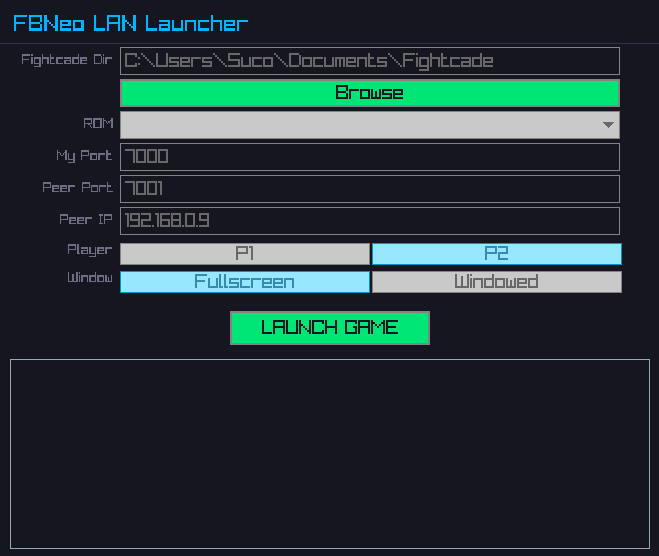

# FBNeo LAN Launcher

Launcher GUI para jogar FBNeo online via rede local (direct connect).

## Dependências

- [raylib](https://www.raylib.com/) (já incluso no w64devkit no Windows)
- Compilador C99 (gcc, MinGW, etc.)
- `make`

## Compilar

### Windows (w64devkit)

```
make
```

### Linux

```
make
```

Binário gerado em `bin/fclauncher` (Linux) ou `bin/fclauncher.exe` (Windows).

## Uso



1. Configure o diretório do Fightcade (botão **Browse**)
2. Selecione o ROM
3. Configure porta e IP do peer
4. Clique em **LAUNCH GAME**

## Estrutura

```
├── src/          # Código fonte (.c)
├── include/      # Headers (.h)
├── build/        # Objetos compilados
├── bin/          # Binário final
└── Makefile      # Build system
```

## Licença

MIT
